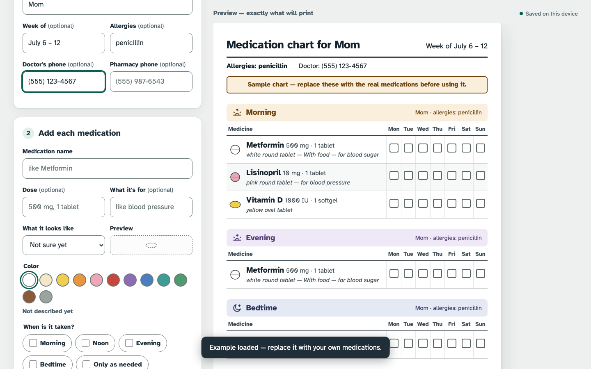
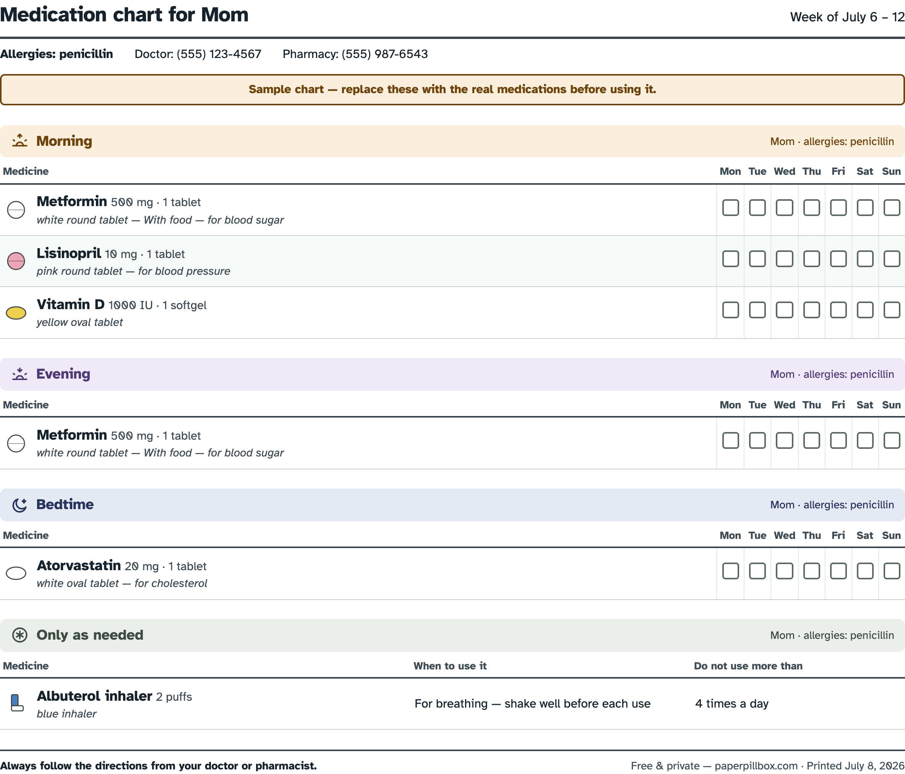

# Paper Pillbox

**Print a clear, large-print medication chart — free, private, and easy to read.**

[**paperpillbox.com**](https://paperpillbox.com)



Somebody you love takes six medications. The pharmacy labels are tiny, the
routine lives in your head, and every "did Mom take her evening pills?" phone
call is a small spike of dread. What actually works, and what nurses have
taped to refrigerator doors for decades, is a simple paper chart: every
medication, every time of day, a checkbox for each day of the week.

The internet's existing "free printable medication chart" tools are ad
farms, PDF lead-magnets, or apps that upload a list of your family's medical
conditions to someone's server. That felt fixable.

## What it does

Type in the medications — name, dose, what the pill looks like, when it's
taken. Paper Pillbox lays out a weekly chart organized the way pill routines
actually work: **morning, noon, evening, bedtime**, plus an *only as needed*
section. Print it, stick it on the fridge, check the boxes.



- **Large print by design.** Set in [Atkinson Hyperlegible](https://www.brailleinstitute.org/freefont/),
  the typeface the Braille Institute designed for low-vision readers, with a
  three-step print size up to extra large.
- **Pill pictures.** Each medication gets a little drawing of its real color
  and shape — so "the small pink round one" is findable at a glance.
- **Time-of-day color bands.** Morning is dawn-amber, noon is sky-blue,
  evening is dusk-violet, bedtime is night-indigo — and every band also
  carries an icon and a label, so the chart still works from a grayscale
  laser printer. On a chart long enough to need a second page, the band
  reprints at the top, because a page that doesn't say *Morning* is a page
  you can't safely act on.
- **Portrait or landscape.** Portrait by default — it fits a binder and a
  fridge door — and the columns re-proportion themselves if you switch.
- **What you see is what prints.** The live preview *is* the printed page.
  No surprises at the printer.
- **Safety details on the sheet.** Allergies, doctor and pharmacy phone
  numbers, print date, and a "follow your pharmacist's directions" reminder.

## Private by design

Nothing you type leaves your browser. There is no server, no account, no
analytics, no cookies — the page is plain HTML, CSS, and JavaScript, and your
chart is saved in your own browser's local storage. You can save a backup
file to your computer and open it again later, on any machine.

This isn't a privacy *policy*, it's a privacy *architecture*: the site has no
backend to leak from.

## Run it yourself

It's a static page. Clone the repo and open `index.html` in a browser —
that's the whole deployment story. To host it, put the files on any static
web server.

```
git clone https://github.com/sethatwood/paper-pillbox.git
open paper-pillbox/index.html
```

No build step, no dependencies, nothing to update. It should work, untouched,
for a very long time.

## Accessibility

The audience for this tool skews older and includes people with low vision,
so accessibility is the product, not a checklist: semantic HTML, WCAG-minded
contrast, full keyboard operability, visible focus, generous touch targets,
`prefers-reduced-motion` support, and a screen-reader-sensible document
structure. If something doesn't work with your assistive tech, that's a bug —
please open an issue.

## Contributing

Bug reports and small, focused pull requests are very welcome. The bar for
new features is deliberately high: this tool's value is that it does one
thing clearly and will never grow a login page. If you're unsure, open an
issue first.

## A note of caution

Paper Pillbox is a memory aid, not medical advice or a medical device.
Always follow the directions from your doctor or pharmacist.

## License

[MIT](LICENSE). The Atkinson Hyperlegible font is © Braille Institute of
America, licensed under the [SIL Open Font License 1.1](fonts/OFL.txt).
